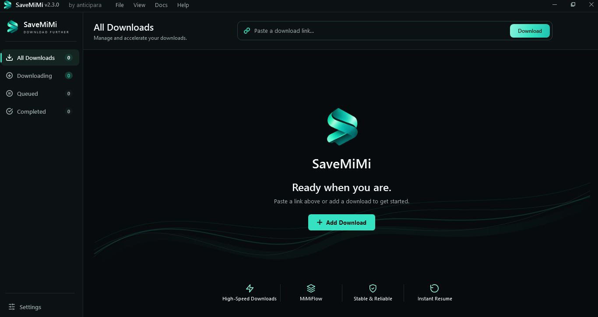

<p align="center">
  
</p>

<h1 align="center">SaveMiMi — Fast Download Manager for Windows</h1>

<p align="center">
  A modern Windows download manager powered by MiMiFlow adaptive download acceleration.
</p>

<p align="center">
  <strong>Fast downloads. Adaptive connections. Reliable resume.</strong>
</p>

<p align="center">
  <a href="../../releases/latest"><strong>Download SaveMiMi</strong></a>
  ·
  <a href="../../releases">Releases</a>
  ·
  <a href="#mimiflow">MiMiFlow</a>
  ·
  <a href="#performance">Performance</a>
</p>

---

## SaveMiMi v2.3

SaveMiMi is a high-performance **download manager for Windows** designed to make better use of the bandwidth available from your connection and the download server.

At its core is **MiMiFlow**, SaveMiMi's adaptive download acceleration system. Instead of relying on one fixed connection configuration, MiMiFlow can adapt download behavior and parallel connections to pursue fast, stable throughput.

SaveMiMi supports direct file downloads such as software installers, archives, ISO images, media files, and other downloadable files over supported HTTP/HTTPS servers.

<p align="center">
  
</p>

## ✨ Features

### ⚡ MiMiFlow Adaptive Download Acceleration

MiMiFlow is SaveMiMi's adaptive download system.

It is designed to monitor download conditions and intelligently manage parallel connections and download behavior instead of forcing every server and network to use the same configuration.

MiMiFlow can adapt based on factors such as:

- Current useful download throughput
- Connection latency
- Individual connection performance
- Server behavior
- Slow download workers
- Download progress and remaining ranges

MiMiFlow is enabled by default.

### 🔗 Custom Connection Mode

Want manual control?

Disable MiMiFlow and choose a fixed connection configuration:

**1 · 2 · 4 · 8 · 16 · 32 connections**

This provides predictable manual control for servers or networks where you want to select the connection count yourself.

### ⏯️ Pause & Resume Downloads

Pause supported downloads and continue them later without starting from the beginning.

SaveMiMi tracks completed byte ranges so supported downloads can continue from their remaining data.

### 🔄 Restart & Recovery

SaveMiMi is designed to preserve unfinished download state.

If the application closes or the computer restarts, supported unfinished downloads can be recovered and resumed instead of being discarded.

### 🌐 Network Recovery

If your internet connection disappears during a download, SaveMiMi can move the download into a waiting/retry state instead of immediately treating a temporary network problem as a permanent failure.

When connectivity returns, supported downloads can continue from their saved progress.

### 📊 Real-Time Download Information

Monitor downloads with useful live information including:

- Download percentage
- Current transfer speed
- Downloaded / total size
- Estimated time remaining (ETA)
- Current download state
- MiMiFlow or Custom mode
- Active connection information

### 📁 Clean Download Destination

SaveMiMi keeps its internal recovery and download-state information separate from your normal destination folder.

The goal is simple:

**Your download folder contains your file — not a collection of internal resume and metadata files.**

### 🎨 Native Windows Experience

SaveMiMi is designed specifically for Windows with a focused desktop interface featuring:

- Dark theme by default
- Full Light theme
- System theme support
- Responsive sidebar
- Windows notifications
- Searchable settings
- Download history and status filtering
- Consistent SaveMiMi visual design

---

<a id="mimiflow"></a>

## 🧠 What is MiMiFlow?

Traditional downloading can use a single connection or a fixed number of parallel connections.

MiMiFlow takes a more adaptive approach.

Instead of assuming that one configuration is always fastest, MiMiFlow is designed to adjust download behavior according to current network and server conditions.

```text
Download URL
     │
     ▼
  MiMiFlow
     │
     ├── Connection 1 ──┐
     ├── Connection 2 ──┤
     ├── Connection 3 ──┤
     ├──     ...        ├──► Downloaded File
     └── Connection N ──┘
